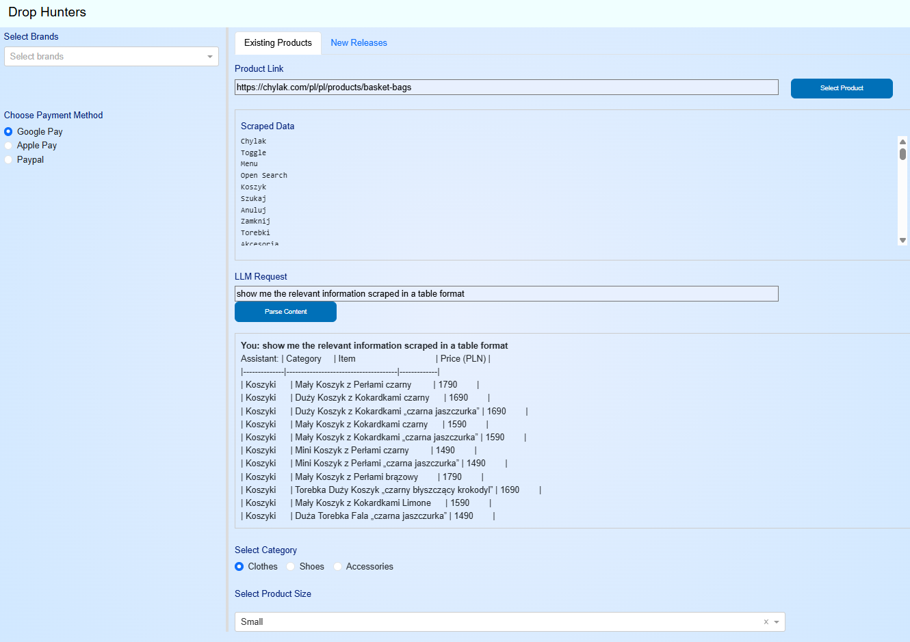

## Drop Hunters

Drop Hunters is a web scraping and automation tool designed to help users track and purchase products from various e-commerce websites. The application scrapes product data, processes it, and provides a user-friendly interface for interacting with the scraped data. Additionally, it includes automation features for purchasing products.

## Getting Started

### Prerequisites
- Python 3.8 or higher
- OpenAI API Key
- Web scraping libraries (e.g., BeautifulSoup, Selenium)
- Payment processing API credentials

### Installation
1. Clone the repository:
    ```sh
    git clone https://github.com/rezart95/drop_hunters.git
    ```
2. Navigate to the project directory:
    ```sh
    cd drop_hunters
    ```
3. Create a virtual environment:
    ```sh
    python -m venv venv
    ```
4. Activate the virtual environment:
    - On Windows:
        ```sh
        venv\Scripts\activate
        ```
    - On macOS/Linux:
        ```sh
        source venv/bin/activate
        ```
5. Install the required dependencies:
    ```sh
    pip install -r requirements.txt
    ```

### Download ChromeDriver
Download the ChromeDriver from the following URL and place it in the project directory:
```html
URL: https://googlechromelabs.github.io/chrome-for-testing/#stable
```

### Environment Variables
Create a `.env` file in the project directory and add your OpenAI API key:
```env
OPEN_API_KEY=your_openai_api_key_here
```

## Project Structure
```
drop_hunters/
├── app.py
├── assets/
│   └── style.css
├── chromedriver.exe
├── dash_app.py
├── Dockerfile
├── downloaded_images/
├── existing_callbacks.py
├── layout.py
├── media/
├── parse.py
├── purchasing.py
├── README.md
├── requirements.txt
├── scrape.py
├── tree.py
├── venv/
├── vision_api.py
├── web_automation.py
├── webscraping.py
└── websites_url.txt
```

## Usage

### Running the Application
To run the Dash application, execute the following command:
```sh
python app.py
```
The application will be accessible at `http://127.0.0.1:8050/`.

### Features
- **Web Scraping**: Scrape product data from specified URLs using BeautifulSoup and Selenium.
- **Data Processing**: Clean and process the scraped data for display and further analysis.
- **Dash Interface**: Interactive web interface built with Dash for visualizing and interacting with the scraped data.
- **Automation**: Automate the process of purchasing products using Selenium.
- **OpenAI Integration**: Use OpenAI's API for natural language processing tasks related to the scraped data.

### Key Files
- `app.py`: Main entry point for the Dash application.
- `dash_app.py`: Initializes the Dash app with Bootstrap components.
- `layout.py`: Defines the layout and structure of the Dash app.
- `existing_callbacks.py`: Contains callback functions for handling user interactions in the Dash app.
- `scrape.py`: Functions for scraping websites and processing HTML content.
- `parse.py`: Handles natural language processing using LangChain and OpenAI.
- `vision_api.py`: Uses OpenAI's vision API to compare images.
- `web_automation.py`: Automates the process of purchasing products on e-commerce websites.
- `webscraping.py`: Example script for scraping product data from a specific website.

## License
This project is licensed under the MIT License. See the [LICENSE](LICENSE) file for details.

## Acknowledgements
- [Dash](https://dash.plotly.com/)
- [BeautifulSoup](https://www.crummy.com/software/BeautifulSoup/)
- [Selenium](https://www.selenium.dev/)
- [OpenAI](https://www.openai.com/)